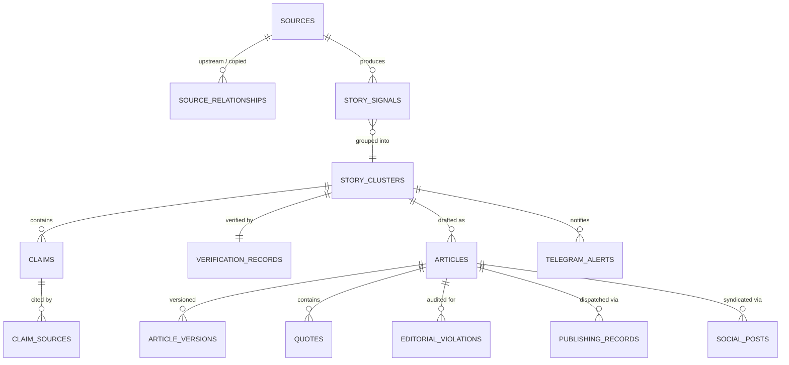

# WireOps Desk: Comprehensive Database Schema & Migration Plan

**Document**: WireOps Database Schema & Migration Plan  
**Author**: Senior Principal Engineer & Database Architect  
**Version**: 2.0.0  
**Target Engine**: PostgreSQL 14.5+ (Supabase)  
**Status**: Architecture Baseline  

---

## 1. Schema Strategy & Non-Destructive Principles

The WireOps Desk database architecture is designed to transition from a single-wire draft store into a relational, multi-source newsroom intelligence graph.

### Architectural Principles:
1. **Zero Data Loss**: Existing working tables (`drafts`, `discovered_stories`, `discovery_feeds`, `discovery_runs`, `legends`, `profiles`, `user_roles`, `approval_audit_log`) are preserved. New tables and columns extend the existing model using non-destructive foreign keys and nullable relationships.
2. **First-Class Source Lineage**: Every source is tracked in a permanent `sources` registry with explicit credibility tiers, copying/syndication tendencies, and administrator overrides.
3. **Immutable Versioning**: Every substantive transformation of an article (AI Draft, Human Edit, Paraphrase, Humanize) generates a discrete row in `article_versions` with word-level diff tracking.
4. **Geographic Hierarchy**: Spatial tagging is modeled down to Kenyan counties, towns, constituencies, wards, and cultural landmarks, with Kakamega indexed as Tier 1.

---

## 2. Complete Entity-Relationship Overview



---

## 3. Detailed Table Specifications

### 3.1 Source Registry & Lineage

#### `public.sources`
The permanent source directory with multi-tier credibility and administrative overrides.

```sql
CREATE TYPE public.source_credibility_tier AS ENUM (
    'global_national_established',
    'regional_established',
    'trusted_local_source',
    'official_source',
    'social_source',
    'unverified_source',
    'low_confidence_source'
);

CREATE TABLE IF NOT EXISTS public.sources (
    id UUID PRIMARY KEY DEFAULT gen_random_uuid(),
    name TEXT NOT NULL,
    domain TEXT NOT NULL UNIQUE,
    homepage_url TEXT NOT NULL,
    feed_url TEXT,
    source_type TEXT NOT NULL DEFAULT 'rss' CHECK (source_type IN ('rss', 'html_portal', 'government_portal', 'social_channel', 'wire_agency')),
    geography TEXT NOT NULL DEFAULT 'national' CHECK (geography IN ('kakamega', 'western_kenya', 'national', 'east_africa', 'international')),
    primary_topics TEXT[] DEFAULT ARRAY['general'],
    credibility_tier public.source_credibility_tier NOT NULL DEFAULT 'unverified_source',
    manual_trust_status TEXT NOT NULL DEFAULT 'standard' CHECK (manual_trust_status IN ('trusted', 'standard', 'under_review', 'blacklisted')),
    ai_confidence_score NUMERIC(5, 4) DEFAULT 0.5000,
    original_reporting_tendency NUMERIC(5, 4) DEFAULT 0.5000,
    syndication_tendency NUMERIC(5, 4) DEFAULT 0.5000,
    consecutive_failures INT NOT NULL DEFAULT 0,
    last_checked_at TIMESTAMPTZ,
    last_success_at TIMESTAMPTZ,
    is_active BOOLEAN NOT NULL DEFAULT true,
    admin_override_notes TEXT,
    created_at TIMESTAMPTZ NOT NULL DEFAULT now(),
    updated_at TIMESTAMPTZ NOT NULL DEFAULT now()
);

CREATE INDEX idx_sources_domain ON public.sources(domain);
CREATE INDEX idx_sources_credibility ON public.sources(credibility_tier);
```

#### `public.source_relationships`
Models source lineage to identify when Outlet B is merely syndicating or copying Outlet A.

```sql
CREATE TABLE IF NOT EXISTS public.source_relationships (
    id UUID PRIMARY KEY DEFAULT gen_random_uuid(),
    source_id UUID NOT NULL REFERENCES public.sources(id) ON DELETE CASCADE,
    related_source_id UUID NOT NULL REFERENCES public.sources(id) ON DELETE CASCADE,
    relationship_type TEXT NOT NULL CHECK (relationship_type IN ('syndicates_from', 'copies_frequently', 'parent_network', 'independent_partner')),
    confidence_score NUMERIC(5, 4) NOT NULL DEFAULT 0.8000,
    evidence_notes TEXT,
    created_at TIMESTAMPTZ NOT NULL DEFAULT now(),
    UNIQUE(source_id, related_source_id, relationship_type)
);
```

---

### 3.2 Signals, Story Clusters & Verification

#### `public.story_signals`
Discrete raw reports ingested from external channels.

```sql
CREATE TABLE IF NOT EXISTS public.story_signals (
    id UUID PRIMARY KEY DEFAULT gen_random_uuid(),
    source_id UUID NOT NULL REFERENCES public.sources(id) ON DELETE CASCADE,
    cluster_id UUID REFERENCES public.story_clusters(id) ON DELETE SET NULL,
    external_url TEXT NOT NULL,
    canonical_url TEXT NOT NULL,
    raw_title TEXT NOT NULL,
    raw_text TEXT,
    excerpt TEXT,
    hero_image_url TEXT,
    author_name TEXT,
    published_at TIMESTAMPTZ,
    detected_at TIMESTAMPTZ NOT NULL DEFAULT now(),
    content_hash TEXT NOT NULL UNIQUE,
    lineage_type TEXT NOT NULL DEFAULT 'original_report' CHECK (lineage_type IN ('original_report', 'secondary_report', 'syndicated_copy', 'social_amplification')),
    created_at TIMESTAMPTZ NOT NULL DEFAULT now()
);

CREATE INDEX idx_signals_cluster ON public.story_signals(cluster_id);
CREATE INDEX idx_signals_hash ON public.story_signals(content_hash);
```

#### `public.story_clusters`
Unified event grouping multiple signals about the same occurrence.

```sql
CREATE TYPE public.story_lifecycle_status AS ENUM (
    'SIGNAL',
    'DEVELOPING',
    'VERIFIED',
    'EDITORIAL_REVIEW',
    'APPROVED',
    'PUBLISHED',
    'REJECTED',
    'ARCHIVED'
);

CREATE TABLE IF NOT EXISTS public.story_clusters (
    id UUID PRIMARY KEY DEFAULT gen_random_uuid(),
    story_code TEXT NOT NULL UNIQUE, -- e.g., WOP-0001842
    working_headline TEXT NOT NULL,
    category TEXT NOT NULL DEFAULT 'community',
    primary_location TEXT NOT NULL DEFAULT 'Kakamega',
    county TEXT DEFAULT 'Kakamega',
    town TEXT,
    geographic_relevance_score INT NOT NULL DEFAULT 0,
    momentum_score INT NOT NULL DEFAULT 0,
    status public.story_lifecycle_status NOT NULL DEFAULT 'SIGNAL',
    is_potential_exclusive BOOLEAN NOT NULL DEFAULT false,
    first_detected_at TIMESTAMPTZ NOT NULL DEFAULT now(),
    last_signal_at TIMESTAMPTZ NOT NULL DEFAULT now(),
    signal_count INT NOT NULL DEFAULT 1,
    source_count INT NOT NULL DEFAULT 1,
    independent_source_count INT NOT NULL DEFAULT 1,
    assigned_editor_id UUID REFERENCES auth.users(id) ON DELETE SET NULL,
    created_at TIMESTAMPTZ NOT NULL DEFAULT now(),
    updated_at TIMESTAMPTZ NOT NULL DEFAULT now()
);

CREATE INDEX idx_clusters_status ON public.story_clusters(status);
CREATE INDEX idx_clusters_location ON public.story_clusters(county, town);
```

#### `public.verification_records`
Auditable proof of verification based on the 3-Independent-Sources or 1-Official-Authority rule.

```sql
CREATE TABLE IF NOT EXISTS public.verification_records (
    id UUID PRIMARY KEY DEFAULT gen_random_uuid(),
    cluster_id UUID NOT NULL UNIQUE REFERENCES public.story_clusters(id) ON DELETE CASCADE,
    is_verified BOOLEAN NOT NULL DEFAULT false,
    rule_applied TEXT NOT NULL CHECK (rule_applied IN ('three_independent_sources', 'official_accountable_authority', 'manual_editor_confirmation', 'insufficient_evidence')),
    independent_sources_count INT NOT NULL DEFAULT 0,
    verified_authority_name TEXT,
    verified_authority_document_url TEXT,
    unresolved_discrepancies JSONB NOT NULL DEFAULT '[]'::jsonb,
    verification_notes TEXT,
    verified_by_user_id UUID REFERENCES auth.users(id),
    verified_at TIMESTAMPTZ NOT NULL DEFAULT now()
);
```

#### `public.claims` & `public.claim_sources`
Granular fact-checking registry documenting individual assertions.

```sql
CREATE TABLE IF NOT EXISTS public.claims (
    id UUID PRIMARY KEY DEFAULT gen_random_uuid(),
    cluster_id UUID NOT NULL REFERENCES public.story_clusters(id) ON DELETE CASCADE,
    claim_text TEXT NOT NULL,
    claim_type TEXT NOT NULL CHECK (claim_type IN ('fact', 'attributed_claim', 'allegation', 'background', 'quotation')),
    is_disputed BOOLEAN NOT NULL DEFAULT false,
    created_at TIMESTAMPTZ NOT NULL DEFAULT now()
);

CREATE TABLE IF NOT EXISTS public.claim_sources (
    id UUID PRIMARY KEY DEFAULT gen_random_uuid(),
    claim_id UUID NOT NULL REFERENCES public.claims(id) ON DELETE CASCADE,
    signal_id UUID NOT NULL REFERENCES public.story_signals(id) ON DELETE CASCADE,
    exact_sentence_in_source TEXT,
    confidence NUMERIC(5, 4) NOT NULL DEFAULT 0.9000,
    created_at TIMESTAMPTZ NOT NULL DEFAULT now()
);
```

---

### 3.3 Articles & Immutable Side-by-Side Versioning

#### `public.articles` (Extends existing `drafts`)
The core article entity for published and in-progress newsroom dispatches.

```sql
CREATE TABLE IF NOT EXISTS public.articles (
    id UUID PRIMARY KEY DEFAULT gen_random_uuid(),
    cluster_id UUID REFERENCES public.story_clusters(id) ON DELETE SET NULL,
    headline TEXT NOT NULL,
    standfirst_deck TEXT,
    lede TEXT NOT NULL,
    body TEXT NOT NULL,
    category TEXT NOT NULL DEFAULT 'community',
    county TEXT DEFAULT 'Kakamega',
    town TEXT,
    word_count INT NOT NULL DEFAULT 0,
    reading_time_minutes INT NOT NULL DEFAULT 3,
    hero_image_url TEXT,
    hero_image_caption TEXT,
    hero_image_attribution TEXT,
    hero_image_type TEXT DEFAULT 'editorial_image' CHECK (hero_image_type IN ('editorial_image', 'stock_image', 'user_upload', 'social_media_image', 'ai_generated_image')),
    author_id UUID NOT NULL REFERENCES auth.users(id),
    approved_by_id UUID REFERENCES auth.users(id),
    status public.story_lifecycle_status NOT NULL DEFAULT 'DRAFT',
    created_at TIMESTAMPTZ NOT NULL DEFAULT now(),
    updated_at TIMESTAMPTZ NOT NULL DEFAULT now()
);
```

#### `public.article_versions`
Side-by-side snapshot registry capturing every major AI or human modification.

```sql
CREATE TABLE IF NOT EXISTS public.article_versions (
    id UUID PRIMARY KEY DEFAULT gen_random_uuid(),
    article_id UUID NOT NULL REFERENCES public.articles(id) ON DELETE CASCADE,
    version_number INT NOT NULL,
    version_tag TEXT NOT NULL CHECK (version_tag IN ('v1_ai_draft', 'v2_editor_edit', 'v3_paraphrase_applied', 'v4_humanization_applied', 'v5_final_published')),
    headline TEXT NOT NULL,
    lede TEXT NOT NULL,
    body TEXT NOT NULL,
    word_count INT NOT NULL,
    changed_by_user_id UUID REFERENCES auth.users(id),
    change_summary TEXT,
    created_at TIMESTAMPTZ NOT NULL DEFAULT now(),
    UNIQUE(article_id, version_number)
);
```

#### `public.quotes`
Guarantees verbatim preservation of direct quotes without automated distortion.

```sql
CREATE TABLE IF NOT EXISTS public.quotes (
    id UUID PRIMARY KEY DEFAULT gen_random_uuid(),
    article_id UUID NOT NULL REFERENCES public.articles(id) ON DELETE CASCADE,
    verbatim_text TEXT NOT NULL,
    speaker_name TEXT NOT NULL,
    speaker_title TEXT,
    source_url TEXT,
    is_verified BOOLEAN NOT NULL DEFAULT true,
    is_protected_from_rewrite BOOLEAN NOT NULL DEFAULT true,
    created_at TIMESTAMPTZ NOT NULL DEFAULT now()
);
```

---

### 3.4 Governance, Multi-Detector Forensics & Publishing

#### `public.editorial_rules` & `public.editorial_violations`
Machine-readable policy and audit log.

```sql
CREATE TABLE IF NOT EXISTS public.editorial_rules (
    id UUID PRIMARY KEY DEFAULT gen_random_uuid(),
    rule_code TEXT NOT NULL UNIQUE, -- e.g., RULE_QUOTE_PRESERVATION, RULE_NO_EMOJI
    title TEXT NOT NULL,
    description TEXT NOT NULL,
    severity TEXT NOT NULL DEFAULT 'error' CHECK (severity IN ('critical_blocker', 'error', 'warning', 'advisory')),
    is_active BOOLEAN NOT NULL DEFAULT true,
    created_at TIMESTAMPTZ NOT NULL DEFAULT now()
);

CREATE TABLE IF NOT EXISTS public.editorial_violations (
    id UUID PRIMARY KEY DEFAULT gen_random_uuid(),
    article_id UUID NOT NULL REFERENCES public.articles(id) ON DELETE CASCADE,
    rule_id UUID NOT NULL REFERENCES public.editorial_rules(id) ON DELETE CASCADE,
    violating_snippet TEXT NOT NULL,
    suggested_fix TEXT,
    is_resolved BOOLEAN NOT NULL DEFAULT false,
    resolved_by_user_id UUID REFERENCES auth.users(id),
    created_at TIMESTAMPTZ NOT NULL DEFAULT now()
);
```

#### `public.detector_runs` & `public.detector_results`
Normalized multi-detector forensics orchestrator tracking provider agreement.

```sql
CREATE TABLE IF NOT EXISTS public.detector_runs (
    id UUID PRIMARY KEY DEFAULT gen_random_uuid(),
    article_id UUID NOT NULL REFERENCES public.articles(id) ON DELETE CASCADE,
    run_timestamp TIMESTAMPTZ NOT NULL DEFAULT now(),
    consensus_signal TEXT NOT NULL CHECK (consensus_signal IN ('consensus_human', 'consensus_ai', 'detector_disagreement', 'inconclusive')),
    provider_count INT NOT NULL DEFAULT 1,
    average_score NUMERIC(5, 2)
);

CREATE TABLE IF NOT EXISTS public.detector_results (
    id UUID PRIMARY KEY DEFAULT gen_random_uuid(),
    run_id UUID NOT NULL REFERENCES public.detector_runs(id) ON DELETE CASCADE,
    provider_name TEXT NOT NULL, -- e.g., 'Turnitin', 'GPTZero', 'InternalEnsemble'
    score NUMERIC(5, 2) NOT NULL,
    confidence TEXT NOT NULL CHECK (confidence IN ('low', 'medium', 'high')),
    highlighted_passages JSONB DEFAULT '[]'::jsonb,
    is_configured BOOLEAN NOT NULL DEFAULT true,
    created_at TIMESTAMPTZ NOT NULL DEFAULT now()
);
```

#### `public.telegram_alerts`
Logs outbound newsroom alerts dispatched to Telegram.

```sql
CREATE TABLE IF NOT EXISTS public.telegram_alerts (
    id UUID PRIMARY KEY DEFAULT gen_random_uuid(),
    cluster_id UUID REFERENCES public.story_clusters(id) ON DELETE CASCADE,
    alert_type TEXT NOT NULL CHECK (alert_type IN ('BREAKING', 'DEVELOPING', 'POTENTIAL_EXCLUSIVE', 'VERIFICATION_COMPLETE', 'EDITOR_ACTION_REQUIRED', 'SYSTEM_FAILURE')),
    message_text TEXT NOT NULL,
    telegram_message_id TEXT,
    delivered BOOLEAN NOT NULL DEFAULT false,
    error_message TEXT,
    created_at TIMESTAMPTZ NOT NULL DEFAULT now()
);
```

---

## 4. Migration & Backward Compatibility Strategy

1. **Retain Existing Views & Tables**: `drafts` and `discovered_stories` will remain active. A database view `public.v_newsroom_drafts` will map `public.articles` seamlessly to `drafts` so existing frontend components remain functional during phased rollout.
2. **Incremental Migration Scripts**: New tables will be introduced via `supabase/migrations/` with idempotent `CREATE TABLE IF NOT EXISTS` clauses.
3. **Data Preservation**: Existing drafts and published stories will be automatically linked to default clusters upon migration execution.
